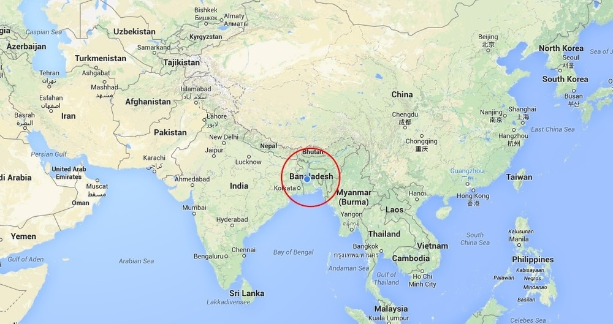
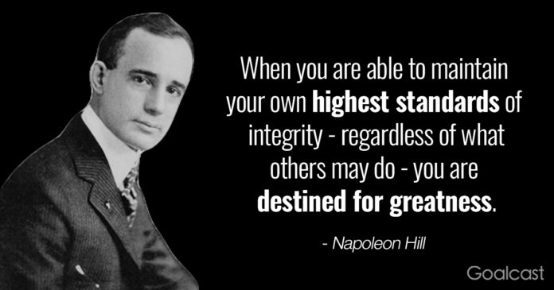

## Introduction

Hello World! I'm **Hasna Hena Mow** from *Dhaka, Bangladesh* (a tiny country shown in the map below). I love to go by my pseudoname **`CipherGirl`**. I'm about to complete my undergrad from Dhaka City College as CS Major.

  

In my earlier academic years I was very fond of Competitive Programming. Later I diverted to exploring different fields in Tech industry. Earlier in 2020, I determined to build my career as Web Developer. Started my journey with freeCodeCamp 🔥.

During 2nd year I got scholarship to attend the world’s largest gathering of women technologists by *AnitaB.org* Instritute, **Grace Hopper Celebration**. The conference was held in Houston, TX, US in Sept 2018. I attended with all my expenses covered by *AnitaB.org* Instritute.

In 3rd year I participated in **Google CodeU 2019** (Asia Pacific), Student Program. It was more like a virtual pre-internship that allows students to program during a 12-week period and gain insider knowledge on how to secure a highly coveted paid-internship. This insider knowledge includes mock interviews, resume workshops and career sessions.

My undergrad life is almost finished (Stuck for COVID-19). Got another great opportunity, **Outreachy** internship @**Mozilla** for the awesome project **FireFox Profiler**. Hoping to put a beautiful end to my undergrad life with the amazing experience of working with **Mozilla**.

## My Core Values

We all have some core values but I guess not everyone conciously focuses on this. In fact, I just recently discovered my core values, I actually never thought about this before writing this blog. Now I find it very useful and important thing for a person as it reflect's a person's fundamental belief.

My top 3 core values are, Integrity, Curiosity and Serenity.

### Integrity

A person with integrity demonstrates sound moral and ethical principles and does the right thing, no matter who's watching. I believe a person with integrity have great self-respect and mindfulness. That's why it's the top one of my core values.

  

### Curiosity

I believe no one grow or develop themselves without curiosty. For me, curiosity leaded me to many opportunities. Curiosity is the reason why I chose to build career in Tech. And I can't thank myself enough for that. I find myself constantly learning and growing. And most importantly you can never be bored when you have a **_Curios Mind_** 😉

### Serenity

Serenity is quality or state of being calm and peaceful. This will allow a person to accept more easily that bad things happen in life and furthermore open your mind to the possibilities of getting through it. I believe no one can truly be happy without inner peace. Serenity is important to me for living the life to the fullest. Well it is the main purpose of life, right?

## Why I applied to Outreachy

I've always felt like minority in Tech. I came from a conservative society where higher studies in Tech field is discouraged for girls. Fortunately I got great support from family to pursue career in STEM specially in Tech. I'm first generation graduate too. In my country most internship opportunities are for fresh graduates. But I noticed students from other countries getting internships, gathering experience and preparing themeselves for the industry so efficiently. This made me feel so lagged behind.

For self development I started working on open source projects in Github. I gained good knowledge about git and collaboration with other developers. I developed day by day. Started to use Free and Open Source Softwares too.

I came to know about outreachy last year. I applied also but my intial application was not approved. For my second time applying, not just my initial application got approved, I got the intership too! I got the opportunity to work with the company I really admire, **Mozilla**. 

I share my belive with Outreachy about diversity in tech and FOSS (Free and Open Source Software). Outreachy made me believe that I belong to their Alum's page. So I tried hard and got it 😇.

---

I hope you had fun knowing about me! Keep an eye out on my blog to know about upcomming journey as Outreachy intern @ Mozilla. Don't hesitate to ping me if you want to know more about Outreachy or any other thing. I'd love to chat with you! You can find ways to contact me here -> [Hasna Hena Mow](https://ciphergirl.github.io/blog/authors/hasna-hena-mow)