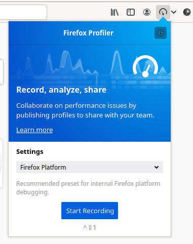
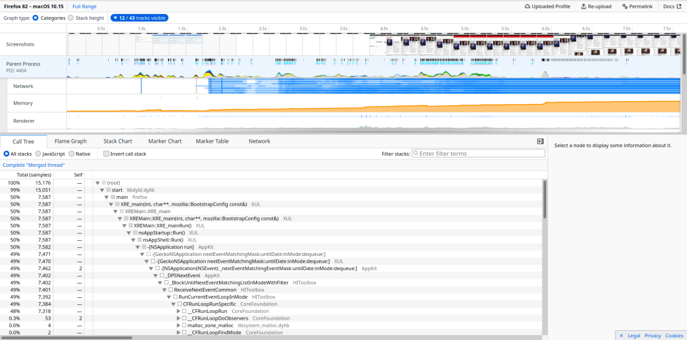

# What is Profiler? 

In simpler terms Profiler is a _Program Analysis Tool_. In software engineering, profiling ("program profiling", "software profiling") is a form of dynamic program analysis that measures, for example, the space (memory) or time complexity of a program, the usage of particular instructions, or the frequency and duration of function calls. Most commonly, profiling information serves to aid program optimization. In genral Profilers are used in the performance engineering process. Profilers may use a number of different techniques, such as event-based, statistical, instrumented, and simulation methods.

# Firefox Profiler

Firefox Profiler is a profiling tool. This web app is the official Firefox Profiler for analyzing performance profiles of Firefox and the Gecko browser engine. It's a statistical profiler with additional data sources like markers, screenshots etc.

When profiling code, there are two primary sources of information—stack: samples and markers.

For **Samples**, the profiler stops the execution of the profiled code at a fixed rate, for example, every 1ms and records relevant information like the current stack. These samples are aggregated together and provide a statistical look into the execution of the program.

**Markers** provide a view into the executing code that does not miss anything. Markers are small pieces of data that are collected every time a specific event happens. For instance, when clicking the mouse, the C++ implementation could call a function that collects the current mouse coordinates and timestamp of the event.

## Usage

It's mainly used by developers. But the non-experts can also capture a profile and share it with experts for inspecting the profiles. We need Firefox browser to capture a profile. But we can see the profiles in any browser with the shared link by Profiler. 

The UI is composed of two parts, which are 1. Recording UI and 2. Analyzing UI.

**Recording UI** is the pop-up generated clicking the add-on in Firefox browswer (It's not there by default, you have to enable it. Visit firefox.profiler.com). It gives the option choose from which platform you are profiling.

  

**Analyzing UI** is where all the data and information is represented. It looks bit intimidating at first look as it holds lots of data and the visualizations. But you can tweak into it easily to find what is needed for you.

  

Profiler has a great end-user documentation explaining the UI and the usage here -> https://profiler.firefox.com/docs/. 

## 'Profiler' Codebase

The codebase is huge but very well organized. It has a developer docs for the contributors in the Profiler Github site (https://github.com/firefox-devtools/profiler/blob/main/docs-developer/README.md). I learned a lot of things from this project. React aside it has Redux, Jest and React Testing Library which were new to me. It uses github actions like the CI, Netlify Deploy Preview and Codecov too. The automated tests are great when someone raises PR and it has errors like lint, flow and the test fails. So we can fix it by ourselves following the doc or get help through project chat before asking for reviews. 

## What made me excited about the project?

It was interesting to me because the issues are categorized well. So I had knoledge of Javascript and somewhat React (No past project experiences TBH) the on-boarding issues were actually pretty easy and after resolving 2-3 of these, the maintainers guide you to solve more complex issues next. So I was pretty confident after completing some on-boarding issues. Despite it's written in JavaScripts framework the codebase was lot for me. I was absolute beginner so I had chance to learn how the tools integrate together bit by bit after starting to contribute to this project.

